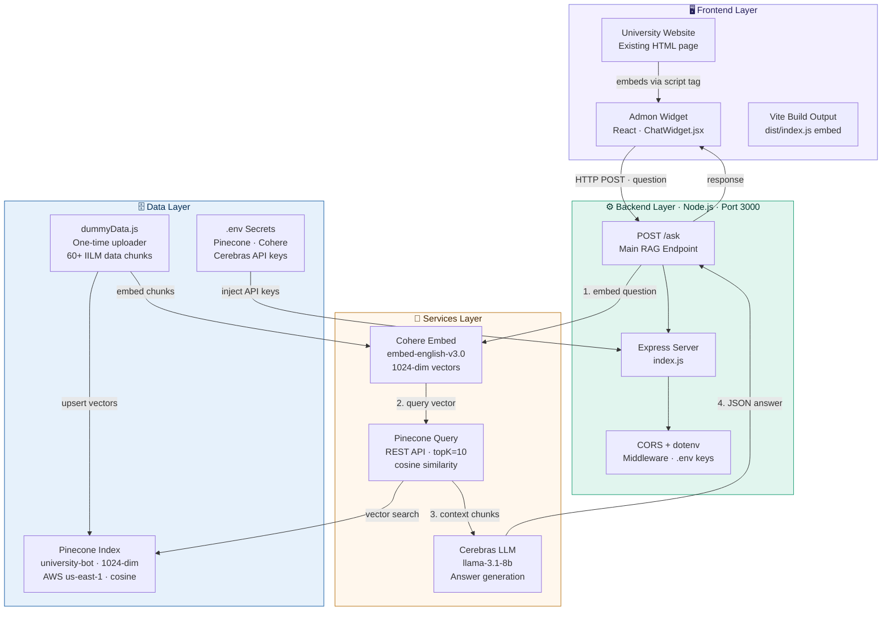

# 🎓 Admon — IILM University Admissions Chatbot

> An AI-powered admissions assistant for IILM University, Gurugram. Built with a RAG (Retrieval-Augmented Generation) pipeline using Cohere, Pinecone, and Cerebras.


---

## 📌 What is Admon?

Admon is a floating chat widget that sits on the IILM University website. Students click the button at the bottom right corner → a chat window opens → they ask admission-related questions → Admon answers accurately using real university data.

Admon only answers IILM University related questions — fees, scholarships, programmes, admissions process, placements, hostel, and more.

---

## 🏗️ Architecture



---

## 🛠️ Tech Stack

| Layer | Technology | Purpose |
|-------|-----------|---------|
| Frontend | React + Vite | Floating chat widget UI |
| Backend | Node.js + Express | RAG pipeline orchestration |
| Embeddings | Cohere `embed-english-v3.0` | Convert text to 1024-dim vectors |
| Vector DB | Pinecone | Semantic similarity search |
| LLM | Cerebras `llama-3.1-8b` | Generate accurate answers |
| Styling | Inline CSS + react-markdown | Markdown rendering in chat |
| Version Control | GitHub | Code storage |
| Deployment | Vercel + Render | Frontend + Backend hosting |

---

## 📁 Project Structure

```
university-chatbot/
├── backend/
│   ├── index.js          # Express server + RAG pipeline
│   ├── .env              # API keys (never pushed to GitHub)
│   ├── package.json
│   └── package-lock.json
├── data/
│   ├── dummyData.js      # One-time data upload script
│   ├── package.json
│   └── package-lock.json
├── frontend/
│   ├── src/
│   │   ├── App.jsx       # Root component
│   │   ├── ChatWidget.jsx # Admon chat widget
│   │   └── main.jsx
│   ├── package.json
│   └── vite.config.js
└── .gitignore
```

---

## 🚀 Getting Started

### Prerequisites

- Node.js v18+
- Accounts on: [Pinecone](https://pinecone.io), [Cohere](https://cohere.com), [Cerebras](https://cloud.cerebras.ai)

### 1. Clone the repository

```bash
git clone https://github.com/BYENOOBZ/university-chatbot.git
cd university-chatbot
```

### 2. Set up environment variables

Create a `.env` file inside the `backend/` folder:

```env
CEREBRAS_API_KEY=your-cerebras-key
PINECONE_API_KEY=your-pinecone-key
PINECONE_INDEX_HOST=https://your-index-host.pinecone.io
COHERE_API_KEY=your-cohere-key
PORT=3000
```

### 3. Install backend dependencies

```bash
cd backend
npm install
```

### 4. Upload data to Pinecone (one-time)

```bash
cd ../data
npm install
node dummyData.js
```

### 5. Start the backend server

```bash
cd ../backend
node index.js
# Server running on port 3000
```

### 6. Start the frontend

```bash
cd ../frontend
npm install
npm run dev
# Open http://localhost:5173
```

---

## 💬 How the RAG Pipeline Works

1. **Student asks a question** in the Admon chat widget
2. **Cohere** converts the question into a 1024-dimensional embedding vector
3. **Pinecone** searches for the top 10 most semantically similar chunks from IILM data
4. **Cerebras LLM** reads the retrieved chunks + question and generates an accurate answer
5. **Answer** is sent back and displayed in the chat with markdown formatting

---

## 📊 What Admon Can Answer

- 💰 Fee structure for all programmes (BTech, MBA, BBA, BCA, Law, Design)
- 🏆 Scholarship criteria (JEE Main, Class 12 boards, CUET, CAT/XAT, Sports, Martyr)
- 📚 Programme details and specialisations
- 📋 Admission process and eligibility
- 🏢 Campus facilities, hostel, dining
- 💼 Placement statistics and top recruiters
- 🌍 Industry collaborations (IBM, Microsoft, Apple, L&T, HCL)

---

## 🔑 API Keys Required

| Service | Purpose | Free Tier |
|---------|---------|-----------|
| [Cohere](https://cohere.com) | Text embeddings | ✅ Yes |
| [Pinecone](https://pinecone.io) | Vector database | ✅ Yes |
| [Cerebras](https://cloud.cerebras.ai) | LLM inference | ✅ Yes |

---

## 🚢 Deployment

### Backend → Render
1. Push code to GitHub
2. Create new Web Service on [render.com](https://render.com)
3. Connect your GitHub repo
4. Set root directory to `backend`
5. Add environment variables from `.env`
6. Deploy!

### Frontend → Vercel
1. Create new project on [vercel.com](https://vercel.com)
2. Connect your GitHub repo
3. Set root directory to `frontend`
4. Deploy!

### Embed on University Website
Add this one line to the university website's HTML:
```html
<script src="https://your-vercel-url.vercel.app/assets/index.js"></script>
```

---

## 👨‍💻 Built By

**Sagar Kaushik** — BTech CSE 2029, IILM University Gurugram

---

## 📄 License

MIT License — feel free to fork and adapt for your university!
